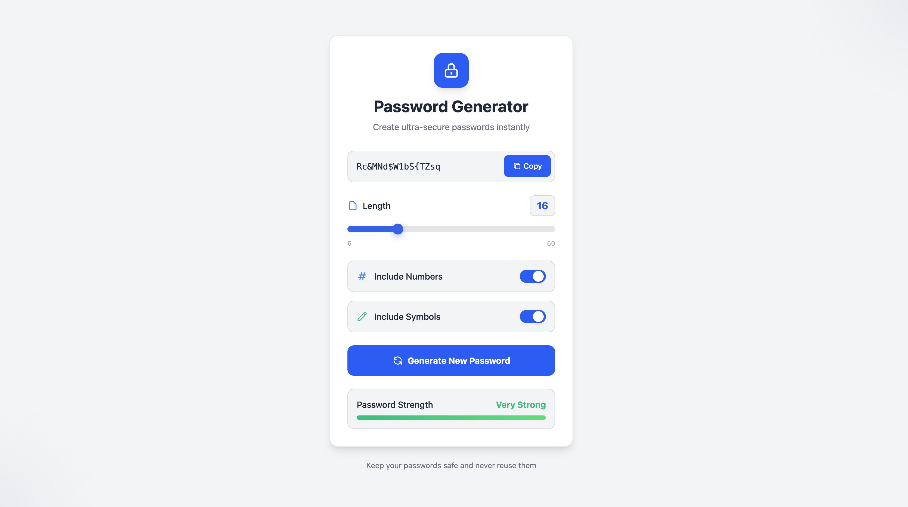
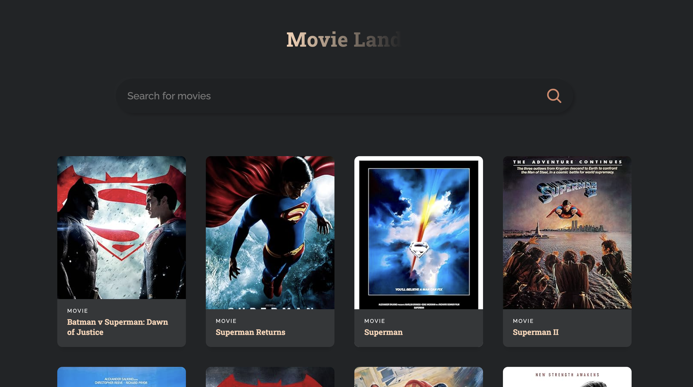
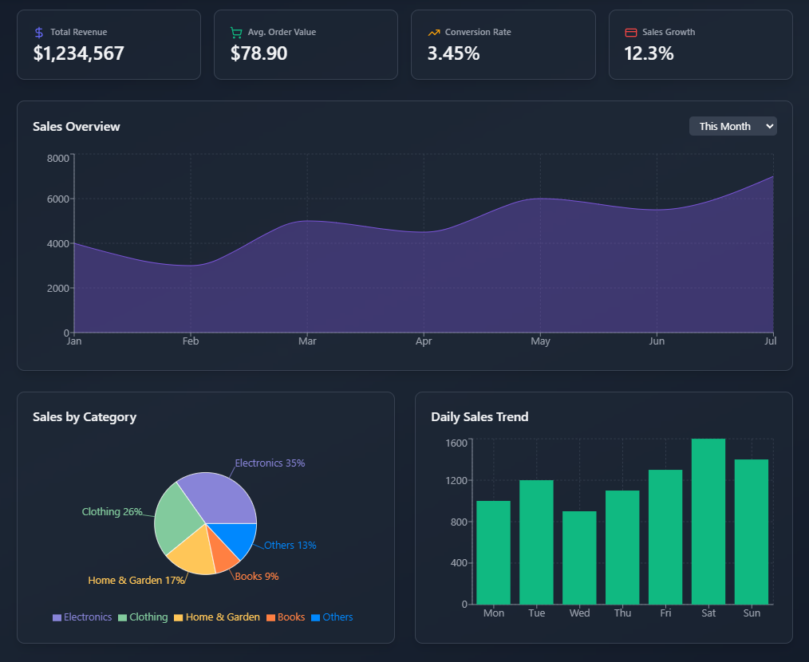
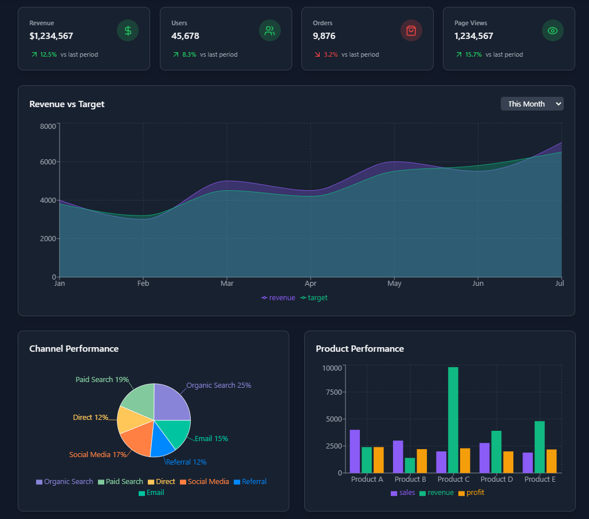
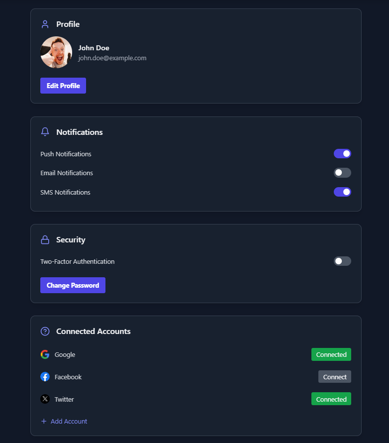
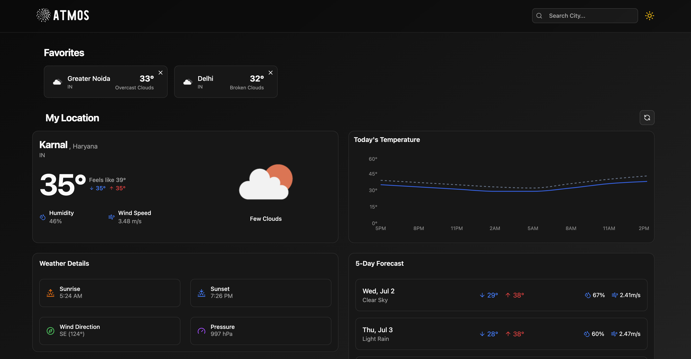

# 🧩 React Projects Collection

A curated collection of beginner‑to‑intermediate level React.js projects built to sharpen frontend development skills. Each project highlights essential concepts like component-driven development, React hooks, user input handling, API consumption, and responsive UI using Tailwind CSS.

Whether you're mastering React basics or experimenting with UI/UX, this repo serves as a practical playground.

---

## ⚙️ Tech Stack

- **React.js** – Functional components with Hooks  
- **JavaScript (ES6+)**  
- **Tailwind CSS** – Utility-first CSS for clean styling  
- **Public APIs** – OMDB, OpenWeatherMap & more  

---

## 📁 Projects Overview

### ✅ Todo App

A dynamic task manager with full CRUD support.

- Add, edit, delete, and mark tasks complete
- Filter by All / Active / Completed
- Saves tasks to `localStorage`
- Tailwind-based animated UI

📷 

---

### 🔐 Password Generator

Generates secure, customizable passwords.

- Choose length, symbols, numbers, uppercase, lowercase
- Copy to clipboard functionality
- Minimal UI with Tailwind styling

📷 

---

### 🎬 Movie Search App

Movie explorer using the OMDB API.

- Search movies by title
- Shows posters, release year, and type
- Debounced search for better UX

📷 

---

### 📊 Admin Dashboard UI

A responsive dashboard layout template.

- Sidebar navigation
- Dashboard cards for overview stats
- Great starter for admin panels or analytics tools

📷 
📷 
📷 

---

### 🌦️ Weather App

Real-time weather dashboard using OpenWeatherMap API.

- Search by city
- Displays temperature, conditions, and icons
- Error handling for invalid cities

📷 

---

## 📚 Key Concepts Practiced

- ✅ React Hooks (`useState`, `useEffect`)  
- 🔁 Form handling & event management  
- 🔗 API integration with `fetch`  
- 🎯 Conditional rendering  
- 💾 LocalStorage persistence  
- 🎨 Responsive UI with Tailwind CSS  

---

## 💡 Ideal For

- React beginners building practical apps  
- Practicing Tailwind-based layouts  
- Exploring component-based design  
- Understanding third-party API usage  

---

Each folder is an independent React project. Navigate inside and run `npm install && npm run dev` to get started.

---

Made with ❤️ by [Dhruv](https://github.com/Dhruv-201004)
